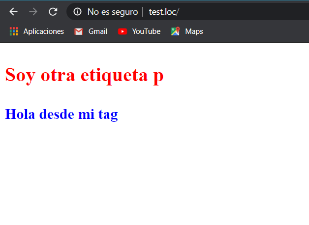

# Vanilla-JS-Web-Components-Class
Vanilla JS clase

## Vanilla JS
Es la manera de usar JS o cualquier otro lenguaje de forma pura sin el uso de otro lenguaje de programación

## Primer componente en Vanilla JS

Web Components permite crear nuestras propias etiquetas en HTML

JS tiene las siguiente APIS para crear componentes de forma nativa, actualmente es un estándart en todos los navegadores

* ES Modules
* Custom elements
* Html template
* Shadow DOM

  
  <small>
Resultado de la clase
</small>

